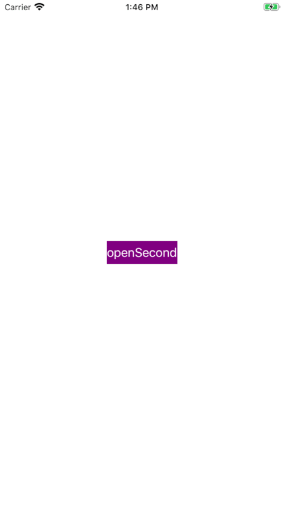

# VIPER-Demo
This is the simplest approach to show VIPER pattern. Demonstrates switching between two Views.
Focus on references between objects(Presenter, View, Router) and show how everything initialise, connected and de-initialise.

### Usage:
* `Protocols`
* `Delegates`

 
### Features: 
* Once the view is "loaded", the configurator creates Presenter, Interactor, Router.
* Interactor does nothing in this demo (there is no logic and data management)
* Once you press the button -> Presenter listens to View and asks Router to do his job.
* The new screen appears. In console you can monitor creation, connections.
* Once you close the View, console will print all "de-init".

Console output:
openButtonClicked
SomeRouter was asked to showSecond()
Configurator init
Presenter init(viewcontroller:)
Presenter.viewcontroller - weak -> viewcontroller
Interactor init(presenter:)
Interactor.presenter - weak -> presenter
Router init(viewController:)
Router.viewController - weak -> viewController
ViewController -> presenter
Presenter.router -> router
Presenter.interactor -> interactor
Presenter closeClicked()
SecondViewController viewWillDisappear(_:)
SecondViewController viewDidDisappear(_:)
Presenter deinit
Interactor deinit
Router deinit
Configurator de-init

